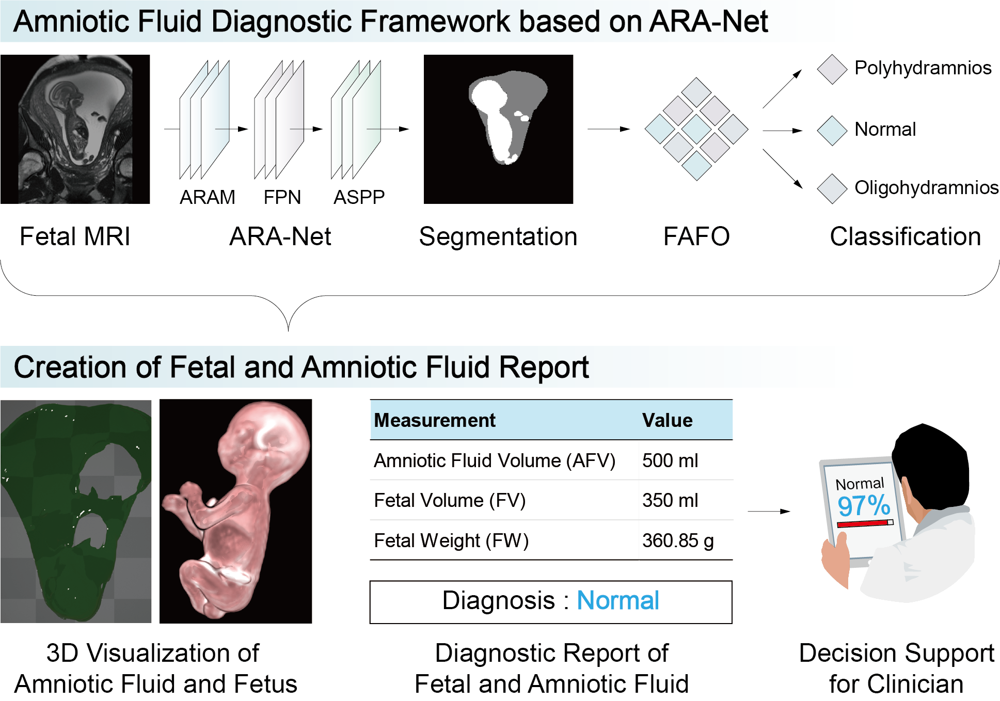

# Adaptive Resolution Attention Network for Precise MRI-based Segmentation and Quantification of Fetal Size and Amniotic Fluid Volume


<div align="center">
  
</div>


## Overview
ARANet presents a novel deep learning approach for accurate segmentation and volume estimation of amniotic fluid from MRI scans. The architecture introduces an innovative Adaptive Resolution Attention Module (ARAM) that significantly enhances segmentation accuracy while maintaining computational efficiency.


## Key Features
- 🔍 **Advanced Attention Mechanism**: Novel ARAM module for enhanced feature extraction
- 🎯 **High Performance**: 
  - Dice Score: 0.961
  - IoU Score: 0.930
  - Classification Accuracy: 100%
- 🌐 **Clinical Integration**: Web-based interface for seamless deployment
- 🔄 **Automated Processing**: End-to-end pipeline for AFV segmentation and classification


## Architecture
A novel architecture comprising ARAM, FPN, and ASPP modules 


<div align="center">
  
</div>


## Web Application Demo


<div align="center">
  <a href="https://www.youtube.com/watch?v=5OP3OZFk1_c" target="_blank">
    
  </a>
</div>


### ▶️ [Watch Full Demo Video](https://www.youtube.com/watch?v=5OP3OZFk1_c)


The web interface provides:
- Simple drag-and-drop MRI upload
- Real-time segmentation visualization
- Automatic volume calculation
- Clinical classification results


## Installation


### Prerequisites
- Python 3.8+
- CUDA 11.0+ (for GPU support)
- PyTorch 1.7+


### Setup
```bash
# Clone the repository
git clone https://github.com/MGH-LMIC/ARANet.git
cd ARANet


# Create and activate virtual environment (optional but recommended)
python -m venv venv
source venv/bin/activate  # Linux/Mac
# or
.\venv\Scripts\activate  # Windows


# Install dependencies
pip install -r requirements.txt
```
for training run:
```
python train.py
```

for evaluation run:
```
evlauation.py
```


 
